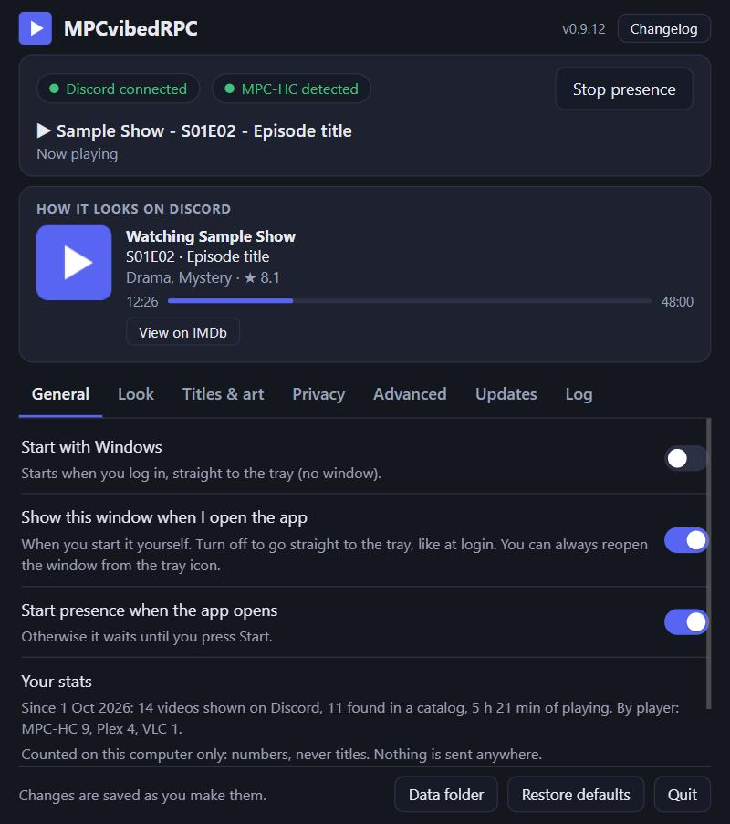
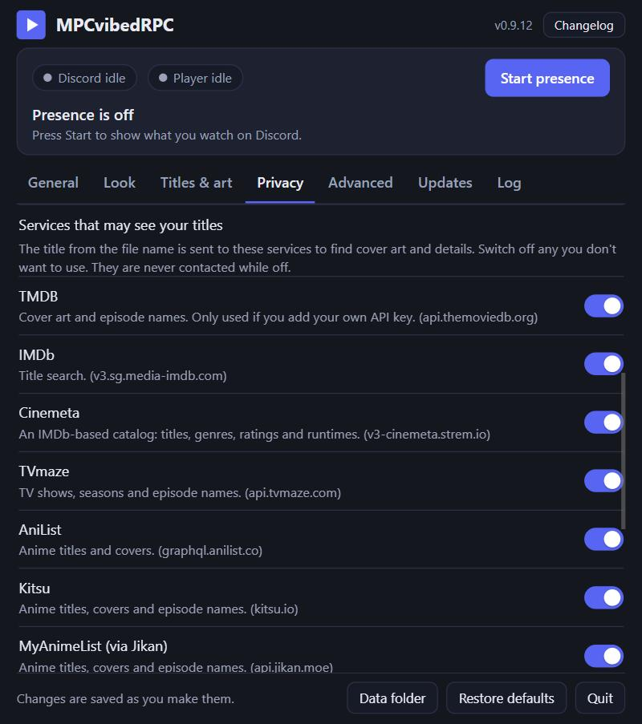

# MPCvibedRPC (hassle-free edition)

> **Entirely AI-generated ("vibe coded").** Every line of this program, its tests, its documentation and its build setup was written by an AI (Claude, by Anthropic) in conversation with the repository owner. The owner did not write it, takes **no credit** for it, and has not reviewed it line by line: their part was giving prompts and trying the result. Use it accordingly. There is no warranty (see `LICENSE`), no promise that it is correct, secure or maintained, and nobody here is an expert you can ask about the code. The idea and the approach come from [angeloanan/MPC-DiscordRPC](https://github.com/angeloanan/MPC-DiscordRPC); the credit for that belongs to its author.

Discord Rich Presence for MPC-HC, MPC-BE, MPC-QT, mpv and VLC on Windows, IINA, mpv, VLC and MPC-QT on macOS, and VLC,
mpv, Celluloid, Haruna, SMPlayer and most other video players on Linux, plus Plex on all three, based on the approach of
[angeloanan/MPC-DiscordRPC](https://github.com/angeloanan/MPC-DiscordRPC):
it reads what's playing from the player (MPC-HC's or VLC's built-in web interface, mpv's IPC connection, MPRIS on Linux, or your Plex server once you sign in to Plex) and forwards what you're watching to Discord.
MIT licensed; see `LICENSE` and `THIRD-PARTY-NOTICES.md`.

  
  

## Use it
### Windows
1. Download **MPCvibedRPC.exe** and run it. There is nothing to install and nothing else is needed.
2. A small window opens and presence is already on: play something in your player. If no player is answering, the window offers
   **Set up the player connection** (see [Players](#players): MPC-QT needs nothing, MPC-HC, MPC-BE and VLC get their web
   interface switched on, mpv gets one line in `mpv.conf`). For **Plex**, press **Sign in to Plex** on the Advanced tab.
3. Optional: switch on **Start with Windows**. It then starts quietly at login, with a tray icon
   (double-click: settings; right-click: start/stop presence, quit). Turn off **Show this window when I open the app**
   (General tab) if you want it to go straight to the tray when you open it yourself too.

A new install greets you with a short welcome card (it reminds you about Discord's "Share my activity" setting and points to the Privacy tab); dismissing it is remembered, and existing installs never see it.

Run the program again at any time to bring the window back. Closing the window leaves it running in the tray.

Requirements: Windows 10/11 (Edge or Chrome for the window; Edge ships with Windows), a supported player (MPC-HC, MPC-BE, MPC-QT, mpv or VLC) or a Plex account, the **Discord
desktop app** with User Settings > Activity Privacy > "Share my activity" on.

### macOS
1. Download **MPCvibedRPC-macos.zip**, open it and move **MPCvibedRPC** to Applications. It runs on Apple silicon and
   Intel Macs with macOS 11 or later.
2. The app is not notarized by Apple (that needs a paid developer account), so the first time macOS refuses to open it.
   Open it once, then go to System Settings > Privacy & Security and choose **Open Anyway** (on macOS 14 and earlier,
   right-click the app > Open works too). Or, in Terminal: `xattr -dr com.apple.quarantine /Applications/MPCvibedRPC.app`.
3. The settings window opens (a window of the app's own; no browser is needed) and presence is already on. For **IINA**,
   press **Set up the player connection** once and reopen IINA; mpv and VLC are set up the same way, MPC-QT needs nothing.
4. The program lives in the **menu bar** (top right), with no Dock icon. Click its icon for the status, **Open
   settings**, **Start/Stop presence** and **Quit**; closing the window leaves it running there, and opening the app
   again shows the window too. **Start at login** (General tab) starts it straight to the menu bar when you log in.

### Linux
1. Download **MPCvibedRPC-linux-amd64** (or `-arm64`), make it executable (`chmod +x MPCvibedRPC-linux-amd64`) and run it.
2. The settings window opens (in Chrome, Chromium, Edge, Brave or Vivaldi as an app window, else in your default browser)
   and presence is already on. **VLC, Celluloid, Haruna, SMPlayer, GNOME Videos, Clapper** and other video players that
   offer MPRIS are found with nothing to set up. mpv needs either the
   [mpv-mpris](https://github.com/hoyon/mpv-mpris) script (packaged by most distributions) or one line in `mpv.conf`,
   which **Set up the player connection** adds.
3. There is no tray icon: the program runs in the background. Run it again to show its window; **Quit** is at the
   bottom of the window. **Start at login** (General tab) adds it to your desktop's autostart.

Requirements on macOS and Linux: the **Discord desktop app** (on Linux also the Flatpak or Snap version) with
"Share my activity" on, and a supported player (or a Plex account: **Sign in to Plex** on the Advanced tab). Music
players and web browsers are never shown, even though they offer MPRIS too.

### All systems
Checking a download: each release file has a `.sha256` file next to it, and GitHub keeps a signed record that it was
built from this repository by its release workflow. With the [GitHub CLI](https://cli.github.com/):

    gh attestation verify MPCvibedRPC.exe --repo CptPakundo/MPCvibedRPC

(or the name of the macOS or Linux file). The program itself is not code-signed, so Windows SmartScreen may warn about
it, and macOS asks you to confirm the first start. See [SECURITY.md](SECURITY.md).

A copy started with its own data folder (the `MPCRPC_HOME` environment variable: a portable setup, a test) keeps its own run-at-login entry and never touches the installed program's.
`MPCRPC_BROWSER` names the browser to show the window in (one that understands `--app`), or `none` for no window at all.

Everything it stores is in `%LOCALAPPDATA%\MPCvibedRPC` (macOS: `~/Library/Application Support/MPCvibedRPC`; Linux:
`~/.local/share/MPCvibedRPC`, or `$XDG_DATA_HOME/MPCvibedRPC`): `config.json` (settings), `mpcvibedrpc.log`,
`artwork-cache.json` and `window\` (the settings window's own browser profile, so your regular Edge is left alone). Delete that folder and the program to remove all traces (turn off "Start with Windows" / "Start at login" first).

## Building the .exe (maintainers)
The program is written in Go and uses only the standard library: one small file (about 8 MB, a few MB of memory while
running), no runtime, nothing to install. Building needs [Go 1.24+](https://go.dev/dl/) and no internet beyond that.

    go run ./tools/mkrsrc -version 0.9.9 -out cmd/mpcvibedrpc/rsrc_windows_amd64.syso    (icon + version details, optional)
    go build -trimpath -ldflags "-H=windowsgui -s -w -X main.version=0.9.9" -o MPCvibedRPC.exe ./cmd/mpcvibedrpc

`-H=windowsgui` makes it a windowed program, so no console flashes up. You can build from any OS (`GOOS=windows`).
Discord's local protocol is implemented in `internal/discord`.

The Linux program is built the same way (`CGO_ENABLED=0 GOOS=linux GOARCH=amd64 go build -trimpath -ldflags "-s -w"
-o MPCvibedRPC-linux-amd64 ./cmd/mpcvibedrpc`). The macOS app is put together on a Mac by
`tools/ci/package-macos.sh VERSION OUTDIR` (both processor types in one program, the app icon, an ad-hoc signature, a zip).

## Updating
The program can update itself from GitHub Releases. When the daily check finds a newer version it shows a notification next to the tray icon (once per version; clicking it opens the window). Put your repository (`owner/repo`) in **Updates** in the window
(or in `config.json` under `app.updateRepo`). It then checks daily, and **Check now / Install** downloads the new
`MPCvibedRPC.exe` (Linux: `MPCvibedRPC-linux-amd64` or `-arm64`), verifies it (and its `.sha256` if the release has one), swaps itself in and restarts.
On macOS the Updates tab offers the release page instead: download the new zip and replace the app (settings are kept).
On macOS and Linux the update shows up in the window only (no notification). GitHub's API answers only 60 checks an
hour per internet address without an account; when it refuses, the program asks GitHub's website for the latest
version instead (the release notes are then missing). To publish
a version:

1. `git tag v0.9.9 && git push --tags` - the workflow in `.github/workflows/release.yml` runs the tests, builds the
   programs on Windows, Linux and macOS runners, smoke-tests each of them (Windows: tray, Discord pipe, autostart,
   self-update; macOS and Linux: the API, login item, player setup, a second start, and on macOS opening the app like
   the Finder does) and attaches them with their `.sha256` files to a release. The tag is the version.

Without a GitHub repository, just replace the program by hand; settings are kept.

## Where things are (for contributors)
| Path | Job |
|---|---|
| `cmd/mpcvibedrpc` | the program: single instance, wiring, log, flags (`--background`, `--after-update`; on macOS `--serve`, the copy that keeps running after the app is opened) |
| `internal/engine` | polls the player, looks up artwork, sends presence; start/stop/apply settings live |
| `internal/core` | settings defaults, filename parsing, the Discord activity itself |
| `internal/artwork`, `internal/jsre` | catalog lookups and episode titles; a regex engine with JavaScript semantics, which the title-matching rules rely on |
| `internal/discord` | Discord's local IPC protocol |
| `internal/mpvipc`, `internal/pipe` | mpv's JSON IPC (mpv and MPC-QT); named pipes on Windows, Unix sockets elsewhere |
| `internal/vlchttp` | VLC's web interface (read-only: `status.json`, `playlist.json`) |
| `internal/mpris`, `internal/dbus` | Linux video players through MPRIS; a small D-Bus client (session bus, method calls) |
| `internal/plex` | Plex: the plex.tv sign-in, the account's servers, and a server's play notifications (read-only) |
| `internal/store`, `internal/jsonx` | `config.json` in `%LOCALAPPDATA%`, the settings schema shown in the window, validation |
| `internal/server`, `internal/assets` | local settings page (`ui.html`) and API on `127.0.0.1`, protected by a per-launch token |
| `internal/winsys` | the operating system: run at login (registry, LaunchAgent, autostart entry), setting up the player connection (web interface, `mpv.conf`, `vlcrc`, IINA's settings), window, tray icon (Win32, no helper process); on macOS the menu bar icon and the settings window (`macapp_darwin.go`, Cocoa and WebKit, in the macOS build only) |
| `internal/updater` | GitHub release check, download, checksum, swap and restart |
| `tools/` | the resource (.syso) and icon writers and the CI scripts (smoke tests, live player tests, the macOS app) |
| `docs/` | the full settings reference (`docs/config.md`) |

`go test ./...` runs everything: the parsers, artwork matching and activity builder are checked against recorded reference output
(tens of thousands of cases, stored as test data in each package's `testdata/`), the engine against a fake MPC-HC, a fake mpv, a fake VLC, a fake Plex and a fake Discord, and the
whole program is built and driven end to end. On GitHub, Linux runs the tests with the race detector, Windows and macOS run them too, each system's
program gets a smoke test, and the engine is run against real players on Linux (mpv, VLC, mpv-mpris, Celluloid, and a real Plex Media Server) and macOS (mpv, and IINA after the program has set it up).

## Behaviour
- **Watching, not Playing.** The activity is sent as type "Watching" with a real Discord
  progress bar (elapsed and total time) while the video plays. It follows seeks and
  playback speed. Discord can't freeze that bar, so while paused you get a text bar instead:
  `⏸ ▰▰▰▰▰▰▱▱▱▱▱▱ 25:00 / 50:00`.
- **Context-aware.** Your status reads "Watching <title>"; the second line shows the
  season and episode with the episode's title (`S01E03 · Episode title`) or the year for movies. For episodes with a known
  season, the image tooltip uses the "Season 1, Episode 3" form that Discord turns into S1E3.
- **Smart titles.** Release junk (BluRay, 1080p, x265, HDR, DDP5.1, WEB-DL, release groups...)
  is stripped, and titles, years, seasons and episodes are recognised in file names such as
  `Show Name Ep03 (2010).mkv`, `Show.Name.S05E14.720p.HDTV.x264-GRP.mkv` or
  `[Group] Show Name - 05 [1080p].mkv`.
- **Cover art, from several sources.** The title parsed from the filename is looked up on
  up to six sources at once, and the highest-priority one with a trustworthy match wins:
  TMDB (only if you add a free API key), IMDb's own search, Cinemeta, TVmaze, AniList, Kitsu and
  MyAnimeList (anime; AniList, then Kitsu, then MyAnimeList are asked first for fansub-style
  filenames, everything else goes IMDb-first) and, as a last resort, Wikipedia (Hebrew titles use
  he.wikipedia.org). Matching is accent-insensitive and checks alternate titles, so a title that a
  catalog lists under a translated name, or whose catalog entries are split into several parts, still resolves.
  A wrong cover is worse than none, so loose guesses are rejected. If a lookup is slow the
  presence appears right away and refreshes with the cover when it arrives. Results are cached
  in `artwork-cache.json`.
  - **Seasons that are different titles.** When a file names a season (`S04`) or a production
    code, the season is resolved in two ways. (1) Catalogs that list each season as its
    own title: a file marked `S04` resolves to the entry named like "<Show>: Fourth Stage" (movies
    included). Numbers are read from words such as "Fourth Stage", "2nd Season", "Season 3" and "II", and
    "Final" is the season after the last numbered one. A production code's letters also match a
    title's initials. (2) Shows with numbered seasons under one title: the season is taken from
    TVmaze (or TMDB with a key), together with that season's own poster. The season's name is shown
    on the second line (`<Season name> · S14 · <code>`).
    If a season can't be placed you get the show's poster and no season name, never a guess.
  - Still no cover? `mpcvibedrpc.log` lists what each source returned. Then pin it with `artworkAliases` or `artworkOverrides` on the Advanced tab (see the end of this list).
  - **Episode titles.** When the filename has an episode number but no name
    (`Show.Name.Ep03...`), the name is looked up (TVmaze, Cinemeta, or TMDB with a key) and shown as
    `S01E03 · <Episode title>`. If a file's numbering doesn't match the catalog, nothing is guessed and
    you keep the plain `E03`. Turn off with `episodeTitles: false`. An anime matched on AniList under its
    Japanese name is also looked up under its English name, which is how TVmaze lists it; a running episode
    number (`Show - 67`) is placed in the right season there, and the file's own number stays on the card.
  - **Info lines.** With a catalog match, a movie shows its year and genres (`1999 · Action, Adventure`) and
    its rating and director (`★ 7.1 · Dir. <name>`); an episode shows its title line and
    the genres and rating (`Action, Adventure · ★ 8.3`). The data comes from Cinemeta (keyed by the IMDb id, cached) and is
    skipped when there is no IMDb id (e.g. AniList-only anime). While paused, the second line
    becomes the pause bar. Turn off with `richInfo: false`.
  - **Robust lookups.** Responses are cached for 10 minutes, identical in-flight requests are
    shared, a timeout / 5xx / 429 is retried once, requests to AniList and MyAnimeList are spaced out,
    and a source that keeps failing is paused for a minute. Order is set by `artworkSources`
    (general) and `animeSources` (anime files).
  - **Anime title language.** For anime matched on AniList, `animeTitles: 'auto'` (default) shows the
    AniList name the filename resembles most: a file that reads like the romaji name gets the romaji
    title, one close to the English name gets the English title. `'english'` / `'romaji'` always use
    that one, and `'file'` keeps the spelling from the filename. Matching checks every name either way.
  - **Anime that IMDb identified.** If IMDb or TVmaze matched a title and its genres include
    Animation, AniList is asked once for the same title (exact name and year). Only the displayed
    name is affected, following `animeTitles`; the poster, link and ratings stay as they were. A
    difference in punctuation alone never replaces the nicer spelling.
  - **Odd filenames it copes with.** Edition and language notes after the year (`1994.DC`,
    `2019.KOREAN`, `(1982) Final Cut`), acronyms written with dots, `Title- Subtitle`
    (shown as `Title: Subtitle`), release-site banners (`www.Site.com - Title`), movie groups such as
    `[YTS.MX]` (not mistaken for anime), a title that ends in a year-like number, a studio possessive
    (`Studio's Show Name`), daily shows (`Show 2024.05.01 Guest`),
    four-digit anime episodes (`Show - 1087`, `S01E1000`) and Japanese `第28話` / `1000話`.
    Camera/phone/screen-recording names and bare dates are never looked up.
  - **Production codes that run across catalog entries.** For files named with a production code
    (`<Show> - S18 - AB065`), when the code number is higher than the matched entry's episode
    count, the next entry that continues the code is used and the number is counted inside it. The
    badge shows your file's season with that number. Episode titles come from that entry's own
    list on Kitsu (`episodeSources` includes `kitsu`). `folderEpisodeNumbers: true`
    instead numbers by position in the season folder.
  - **Episode titles from a fan wiki.** Files with production codes get their title from
    Bulbapedia's own episode list, since those codes are that wiki's numbers (`episodeSources` starts with
    `bulbapedia`; only the series it covers are known, other series fall back to the catalogs).
  - **Show name from the folder.** If a filename has only an episode number (`S01E02.mkv`,
    `Episode 3.mkv`, `03.mkv`), the folder's name is used as the show, e.g. `...\Show Name\Season 1\S01E02.mkv`.
    `Season N` folders are skipped (and supply the season for bare numbers); generic folders like
    `TV` or `Downloads` are ignored. Folder names get the same cleanup (`Show.Name.2008.1080p`).
    Disable with `useFolderName: false`.
  - **Movies named with a franchise prefix.** A file such as `Franchise Movie 15 - Subtitle`
    is retried by its subtitle, and a result is only accepted if it contains both the subtitle and
    the franchise name, so unrelated titles aren't matched. The other way round, `Title A Franchise Mystery 2025`
    (from `Title: A Franchise Mystery`, a name catalogs often list as just `Title`) is retried as `Title` when
    nothing else matches, only with the file's year, and shown as `Title: A Franchise Mystery` (also for
    `A ... Story`, `Movie`, `Film`, `Adventure`, `Tale`, `Saga`, `Legend`, `Odyssey`).
    Advanced settings in the window (or `config.json`): `artworkAliases: { 'my show': 'Official Name' }` searches under another name,
    `artworkOverrides: { 'my show': 'https://.../poster.jpg' }` uses your own image.
  - Set `showArtwork: false` (the first switch on the Privacy tab) to stay fully offline (this also disables episode-title lookups) (otherwise the title parsed from your
    filename is sent to these services).
- **Preview.** While a status is showing, the window has a **How it looks on Discord** card: the title lines, cover,
  progress bar and link button, built from what was actually sent (so it also shows the basic-mode fallback).
- **Hiding things** (Privacy tab). **Hide what I'm watching** shows only "Watching a video" with the progress bar (no title, cover or buttons, and nothing looked up). **Never show these files** takes folders, names or wildcards (such as `Private` or `*.xyz`); a listed file shows no status at all and is never looked up. Hidden names are not written to the log either.
- **Privacy controls** (Privacy tab). Every online service the program can ask about a title has its own switch, with what it
  is used for and where requests go; a switched-off service is never contacted. One switch turns all lookups off (fully
  offline). **Clear my status when paused for N minutes** takes the status down after a long pause (30 minutes by default; 0 = never) and brings
  it back when you play again or seek. **Clear cover cache** forgets everything that was looked up. There is no analytics or
  tracking, and file paths are never sent.
- Clears itself when you stop or close the player; reconnects on its own if Discord restarts.
  If Discord ever rejects the Watching format, it falls back to a basic presence automatically.
- Options live in the settings window and save as you change them (**Restore defaults** resets them all); the full list with defaults is in [`docs/config.md`](docs/config.md) (extra ones go in
  `config.json`). Set `activityType` to `playing` for the classic look. Log: `mpcvibedrpc.log` (also in the window).

## Players
The program asks the players in this order and shows the first one that is playing something (if none is, the window still names the first that answers):

| Player | How it is read | Setup |
|---|---|---|
| MPC-HC | its web interface (`http://127.0.0.1:13579/variables.html`) | Options > Player > Web Interface > Listen on port, or the **Set up the player connection** button (it closes and reopens MPC-HC, and keeps a web interface it switches on to this PC only) |
| MPC-BE | the same web interface | the same; MPC-BE keeps the switch in `[WebServer]` of `mpc-be64.ini` or the registry, the button handles both (also this PC only) |
| MPC-QT | its own mpv-style connection (`cmdrkotori.mpc-qt.mpv`), always on | none (its web interface works too, if you turned it on) |
| mpv | its JSON IPC (`input-ipc-server`) | `input-ipc-server=mpvsocket` in `mpv.conf`; the button adds it (`portable_config\mpv.conf` next to a portable mpv, else `%APPDATA%\mpv\mpv.conf`; on macOS and Linux `~/.config/mpv/mpv.conf` with the full path of the socket, such as `/tmp/mpvsocket`) and keeps a name you already set. mpv reads it when it starts. |
| IINA (macOS) | its mpv core's JSON IPC | IINA Settings > Advanced: enable advanced settings and add the mpv option `input-ipc-server` with a socket path. The button does both (it keeps a socket you already set) and IINA uses it once it is reopened. |
| VLC | its web interface (`http://127.0.0.1:8080/requests/status.json`, with a password) | Tools > Preferences > All > Interface > Main interfaces: tick Web, and set a password under Lua > Lua HTTP; copy it to **Advanced > VLC web interface password**. Or press the button: it switches the interface on in `vlcrc` (`portable\vlcrc` next to a portable VLC, else `%APPDATA%\vlc\vlcrc`), gives it a password and fills it in for you. It keeps a password and port you already set, and an interface it switches on only answers this PC (`http-host=127.0.0.1`; VLC also uses that address for streams sent over HTTP without one). VLC rewrites `vlcrc` when it exits, so a running VLC is closed and reopened if something has to change. On macOS the same, in `~/Library/Preferences/org.videolan.vlc/vlcrc`. On Linux VLC needs none of this: it is found through MPRIS. |
| Linux video players | MPRIS over D-Bus: VLC, Celluloid, Haruna, SMPlayer, GNOME Videos (Totem), Showtime, Clapper, Dragon Player, Kodi, Parole, QMPlay2, MPC-QT, and mpv with the mpv-mpris script | none; **Advanced > Find video players through MPRIS** switches it off. Music players and web browsers are left out. |
| Plex | your Plex Media Server's play notifications, for whatever you play with your Plex account: the Plex app on this computer, Plex Web, a TV, a phone | **Advanced > Sign in to Plex**: plex.tv opens in your browser, you approve the sign-in there (the program never sees your password), and it follows your server (choose another one under the button; your own servers come first, then those shared with you). **Plex server address** is only needed when this computer cannot reach the server at the addresses plex.tv lists. |

MPC-HC (2.8.3 here) is what the program was built around; MPC-BE 1.9.1, MPC-QT 26.07, mpv 0.41.0 and VLC 3.0.24 were tried on Windows 11, set up as above (and a development build of VLC 4, which is not released yet). On macOS and Linux, mpv, IINA, VLC, mpv-mpris and Celluloid are tried on GitHub's test machines with every change, with a stand-in for Discord. IINA on a real Mac with the real Discord was tried by a tester; Linux has not been tried on a real desktop yet. Streams show their title (there is no file name or folder). With players other than the MPC family, the image tooltip names the player ("mpv", "IINA", "VLC media player", ...) instead of "Media Player Classic". VLC's web interface is asked after mpv and IINA, and only once its password is set; then MPRIS players, and Plex last, only while you are signed in.

Plex: the program signs in like a Plex app (it introduces itself to Plex as "MPCvibedRPC") and
keeps the sign-in in `config.json`; **Sign out** or **Restore defaults** removes it. It only reads: titles, episode
numbers and the position of what you play. On a server you own, it shows only your own playback, not that of people you
share with; music and photos are never shown as "Watching". Plex playback on any of your devices counts, not only on this
computer. The episode or movie name comes from your server, and cover art is looked up the same way as for files. Plex
is tried on GitHub's test machines with every change: the official Plex Media Server, without a Plex account, with a
stand-in player reporting playback to it. Signing in with a real Plex account, servers shared by someone else and real
Plex apps have not been tried yet.

## Troubleshooting
- Nothing shows: the window's player pill says which player is reachable, if any. If none, press **Set up the player connection**,
  or (MPC-HC, MPC-BE) check http://127.0.0.1:13579/variables.html while a video plays. mpv only reads `mpv.conf` when it starts, so restart it after setting it up.
  VLC: the window says when VLC refuses the password or the port belongs to another program (8080 is a common
  default; change it in VLC and in **Advanced > VLC web interface port**).
- Plex: the window says when the server cannot be reached or Plex refused the sign-in (then sign out and sign in
  again). If the server runs on your network but is not found, put its address in **Advanced > Plex server address**
  (for example `http://192.168.1.20:32400`). Plex shows up once something plays and the server tells the program;
  Plex apps report every few seconds, so the status can lag that much behind.
- Discord pill: "on standby" until something plays (Discord is only contacted then). If it stays on "Waiting for Discord" while a video plays, use the Discord desktop app (not the browser); starting it before or after the program both work.
- No icon: image keys in the settings must match art assets in the Discord application.
- Reporting a problem: on the **Log** tab, **Copy diagnostics** copies the version, the settings that differ from the defaults and the recent log, with titles, file names and paths left out (the text is shown so you can check it first). Paste it into the issue.
- No window appears: run the program again, or right-click its tray icon > Open settings. On macOS, click the menu bar icon > Open settings, or open the app again; on Linux, run the program again.
- macOS says the app "cannot be opened" or "is damaged": it is not notarized; see [macOS](#macos) step 2.
- IINA is not found: after **Set up the player connection**, quit IINA completely (IINA > Quit IINA) and open it again.
- Linux: a player that is not found probably has no MPRIS support or is not on the list above (it is a list, so that
  music players and browsers never show up as "Watching"); please report it. mpv needs the mpv-mpris script or the line in `mpv.conf`.
