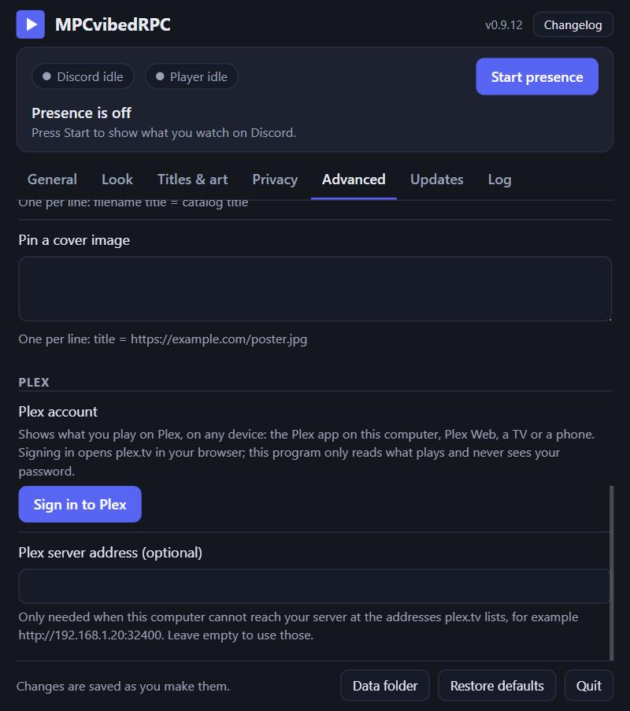

# MPCvibedRPC

**Show what you're watching on Discord.** 
A tiny app for MPC-HC, MPC-BE, MPC-QT, mpv, VLC, IINA and Plex, with clean titles, cover art and a real progress bar.

Linux on ARM: <a href="https://github.com/CptPakundo/MPCvibedRPC/releases/latest/download/MPCvibedRPC-linux-arm64">MPCvibedRPC-linux-arm64</a> · <a href="https://github.com/CptPakundo/MPCvibedRPC/releases/latest">All files and what's new</a>

> **Made with AI ("vibe coded").** The code, tests and documentation were written by an AI (Claude, by Anthropic) from
> the repository owner's prompts and testing. There is no warranty (see `LICENSE`). The idea and the approach come from
> [angeloanan/MPC-DiscordRPC](https://github.com/angeloanan/MPC-DiscordRPC); the credit for that belongs to its author.

## ✨ What you get

- 🎬 **"Watching Sample Show"** on your profile, with the episode, its title and a progress bar that follows seeking and pausing.
- 🧹 **Clean titles** from messy file names: `Show.Name.S01E02.1080p.WEB-DL.x265-GRP.mkv` becomes *Show Name · S01E02*.
- 🖼️ **Cover art, episode names and ratings**, looked up in several free catalogs (IMDb, TVmaze, AniList and more).
- 📺 **Your players**: MPC-HC, MPC-BE, MPC-QT, mpv and VLC on Windows; IINA, mpv, VLC and MPC-QT on macOS; VLC, mpv, Celluloid, Haruna and most other video players on Linux; and **Plex** on any device.
- 🔒 **Private by design**: hide titles or whole folders, choose which services may see a title, or stay fully offline. No tracking.
- 🪶 **Tiny and tidy**: one ~8 MB file, nothing to install, updates itself.

## 🚀 Getting started

Every system needs the **Discord desktop app** with *User Settings > Activity Privacy > "Share my activity"* turned on.

**Windows 10/11**
1. Download **MPCvibedRPC.exe** and run it. There is nothing to install. SmartScreen may warn, because the program
   isn't code-signed: choose *More info > Run anyway*.
2. Play something. If your player isn't found yet, press **Set up the player connection** in the window.
3. Optional: **Start with Windows** (General tab) starts it quietly in the tray when you log in.

**macOS 11 or later** (Apple silicon and Intel)
1. Download **MPCvibedRPC-macos.zip**, open it and move the app to Applications.
2. The app isn't notarized by Apple, so the first time it won't open: go to *System Settings > Privacy & Security* and
   choose **Open Anyway**.
3. It lives in the menu bar. For IINA, press **Set up the player connection** once and reopen IINA.

**Linux** (x64 and ARM64)
1. Download **MPCvibedRPC-linux-amd64** (or `-arm64`), run `chmod +x` on it and start it.
2. VLC, Celluloid, Haruna and most other video players are found by themselves. mpv needs the
   [mpv-mpris](https://github.com/hoyon/mpv-mpris) script, or one line the setup button adds.
3. There's no tray icon: run the program again to show its window.

**Plex** (any system): press **Sign in to Plex** on the Advanced tab and approve it on plex.tv. Whatever you play with
your Plex account then shows up, on any device.

## 📺 Players

| Player | Windows | macOS | Linux | Setup |
|---|:---:|:---:|:---:|---|
| MPC-HC | ✓ | | | one click (switches on its web interface) |
| MPC-BE | ✓ | | | one click |
| MPC-QT | ✓ | ✓ | ✓ | none |
| mpv | ✓ | ✓ | ✓ | one click (a line in `mpv.conf`) |
| VLC | ✓ | ✓ | ✓ | one click on Windows and macOS (its web interface); none on Linux |
| IINA | | ✓ | | one click, then reopen IINA |
| Celluloid, Haruna, SMPlayer, GNOME Videos, Clapper and more | | | ✓ | none |
| Plex (TV, phone, Plex Web, desktop app) | ✓ | ✓ | ✓ | sign in on the Advanced tab |

"One click" is the **Set up the player connection** button in the window. Exactly what each player needs, and how it is
read, is in [How it works](docs/how-it-works.md#players-in-detail).

## 🔒 Privacy

- Everything runs on your computer. Discord is only contacted once something plays.
- To find covers, the **title** (never the file path) is sent to the catalog services you allow. The **Privacy** tab has
  a switch for each one, plus one switch to stay fully offline.
- **Hide what I'm watching** shows just "Watching a video". **Never show these files** hides folders or names completely.
- Your status clears itself after a long pause (30 minutes, adjustable).
- **Your stats** (General tab) count videos and watch time on your computer only. Nothing is ever sent anywhere: no
  analytics, no tracking. The download count above is GitHub's public count of release downloads.
- With Plex, the program talks to plex.tv and your Plex server only while you're signed in, and only reads.

## ❓ Help

<b>Nothing shows on Discord</b>

- The window's pills tell you what's going on. "No player found": press **Set up the player connection**. mpv and IINA
  read their settings when they start, so restart them afterwards.
- IINA isn't found: after setting it up, quit IINA completely (IINA > Quit IINA) and open it again.
- "Discord on standby" is normal until something plays. If it stays on "Waiting for Discord" while a video plays, use
  the Discord desktop app (not the browser) and check that "Share my activity" is on.
- VLC: the window says when VLC refuses the password, or another program uses its port (8080). Change the port in VLC
  and in **Advanced > VLC web interface port**.
- Linux: a player that isn't found probably doesn't offer MPRIS, or isn't on the list yet (music players and browsers
  are left out on purpose). Please report it.

<b>Plex</b>

- The window says when the server can't be reached, or Plex refused the sign-in (then sign out and in again).
- A server on your network that isn't found: put its address in **Advanced > Plex server address**, for example
  `http://192.168.1.20:32400`.
- Plex apps report every few seconds, so the status can lag that much behind. On your own server only *your* playback
  is shown; music and photos never are.
- Tried with the official Plex Media Server on GitHub's test machines. A real Plex account and real Plex apps haven't
  been tried yet; reports are welcome.

<b>The window doesn't open</b>

Run the program again, or right-click its tray icon > Open settings. On macOS, click the menu bar icon > Open settings
or open the app again; on Linux, run the program again. Closing the window leaves the program running.

<b>Wrong title or no cover</b>

The log (Log tab, or `mpcvibedrpc.log`) lists what each catalog returned. You can search under another name or pin
your own cover image on the Advanced tab. A free TMDB key (Titles & art tab) improves some matches.

<b>Where are my settings? How do I remove it?</b>

Everything is in `%LOCALAPPDATA%\MPCvibedRPC` (macOS: `~/Library/Application Support/MPCvibedRPC`; Linux:
`~/.local/share/MPCvibedRPC`): settings, log, cover cache, your stats, and the window's own browser profile (your
regular browser is left alone). Turn off "Start with Windows" / "Start at login", then delete that folder and the program.
Every setting with its default is in [docs/config.md](docs/config.md).

<b>Updates</b>

The program checks for new versions when it starts and once a day (switch it off on the Updates tab). On Windows and Linux,
**Install** downloads the new version, checks it and restarts; on macOS the Updates tab links to the download. After an
update the window shows what's new once; the **Changelog** button at the top shows every version.

<b>Is the download safe?</b>

Each release file has a `.sha256` checksum next to it, and GitHub keeps a signed record that it was built from this
repository. With the [GitHub CLI](https://cli.github.com/): `gh attestation verify MPCvibedRPC.exe --repo CptPakundo/MPCvibedRPC`.
See [SECURITY.md](SECURITY.md).

<b>Reporting a problem</b>

On the **Log** tab, **Copy diagnostics** copies the version, the settings you changed and the recent log, with titles,
file names and paths left out. Paste it into a [new issue](https://github.com/CptPakundo/MPCvibedRPC/issues/new/choose).

## 📚 More

- [How it works](docs/how-it-works.md): title cleanup, cover lookups, and each player in detail.
- [All settings](docs/config.md), with their defaults.
- [Development](docs/development.md): building, testing and releasing.

## 🙏 Credits

Based on the idea and approach of [angeloanan/MPC-DiscordRPC](https://github.com/angeloanan/MPC-DiscordRPC).
MIT licensed; see `LICENSE` and `THIRD-PARTY-NOTICES.md`.
